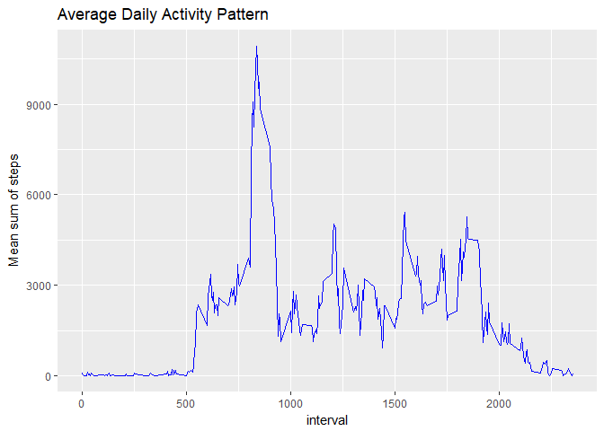
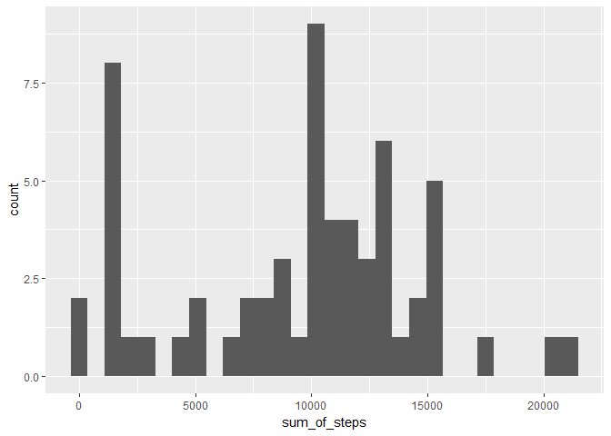

# Reproducible Research: Peer Assessment 1


## Loading and preprocessing the data

```r
unzip("activity.zip")
data <- read.csv("activity.csv", header = TRUE, stringsAsFactors = FALSE)
```

## Histogram of the total steps taken per day

```r
library(ggplot2)
library(dplyr)
```

```
## 
## Attaching package: 'dplyr'
```

```
## The following objects are masked from 'package:stats':
## 
##     filter, lag
```

```
## The following objects are masked from 'package:base':
## 
##     intersect, setdiff, setequal, union
```

```r
data %>% group_by(date) %>% summarise(sum_of_steps = sum(steps)) %>% 
  ggplot(aes(x = sum_of_steps)) + geom_histogram(bins = 30) + 
  xlab("Sum of steps per day") + ggtitle("Histogram for Sum of Steps Per Day")
```

```
## Warning: Removed 8 rows containing non-finite values (stat_bin).
```

<!-- -->

## What is mean total number of steps taken per day?

```r
data %>% group_by(date) %>% na.omit() %>% summarise(sum_of_steps = sum(steps)) %>%
  summarise(mean = mean(sum_of_steps), median = median(sum_of_steps))
```

```
## # A tibble: 1 × 2
##       mean median
##      <dbl>  <int>
## 1 10766.19  10765
```


## What is the average daily activity pattern?

```r
data %>% group_by(interval) %>% na.omit() %>% summarise(sum_of_steps = sum(steps), mean = mean(sum_of_steps)) %>% ggplot(aes(x = interval, y = mean, group = 1)) + geom_line(col = "blue") + ylab("Mean sum of steps") +
  ggtitle("Average Daily Activity Pattern")
```

<!-- -->
## The 5-minute interval that, on average, contains the maximum number of steps

```r
interval <- data %>% group_by(date) %>% filter(steps == max(steps)) %>% group_by(interval) %>% summarise(n = n()) %>% filter(n == max(n))
```
The 5-minute interval that on average contains the maximum number of steps, is interval 815.


## Imputing missing values

```r
number_NAs <- sum(!complete.cases(data))
```
Number of missing values is 2304.


Missing values in steps column are filled in with the median values for that 5-minute interval.


```r
data_full <- data

for (i in 1:nrow(data)) {
  if (is.na(data[i,1])) {
    data_full[i, 1] <- data %>% na.omit() %>% filter(interval == data[i, 3]) %>% summarise(median = median(steps))
  }
}
```


```r
data_full %>% group_by(date) %>% summarise(sum_of_steps = sum(steps)) %>% ggplot(aes(x = sum_of_steps)) +
  geom_histogram(bins = 30)
```

<!-- -->

```r
data_full %>% group_by(date) %>% na.omit() %>% summarise(sum_of_steps = sum(steps)) %>%
            summarise(mean = mean(sum_of_steps), median = median(sum_of_steps))
```

```
## # A tibble: 1 × 2
##       mean median
##      <dbl>  <int>
## 1 9503.869  10395
```
Both the mean and median for the total amount of steps taken per day are smaller after imputing missing values.


## Are there differences in activity patterns between weekdays and weekends?


```r
data_full$weekdays <- weekdays(as.Date(data_full$date), abbreviate = TRUE)
weekend <- c("la", "su")

data_full$weekdays <- ifelse(data_full$weekdays %in% weekend, "weekend", "weekday")


data_summary <- data_full %>% group_by(weekdays, interval) %>% na.omit() %>% summarise(sum_of_steps = sum(steps),                 mean = mean(sum_of_steps))
data_summary %>% ggplot(aes(x = interval, y = mean, col = weekdays)) + geom_line() + facet_wrap(~weekdays, 
                ncol = 1) + labs(y = "Mean sum of steps", col = "Days", 
                title = "Difference in Activity Patterns Between Weekdays and Weekends")
```

<!-- -->


